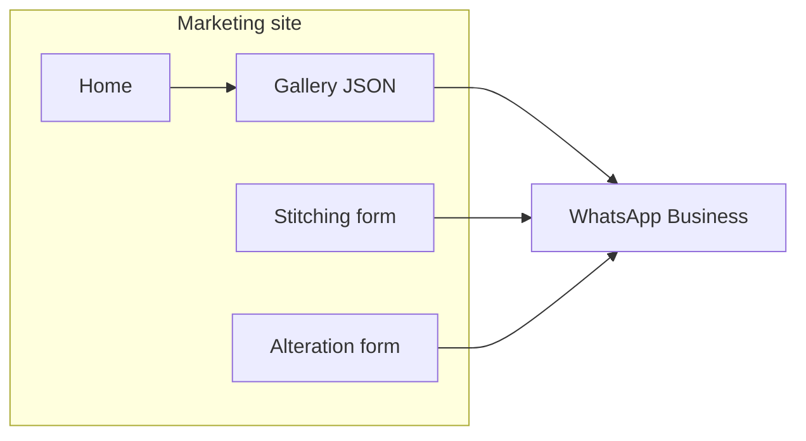

# Architecture & operations

> **Run, deploy, env vars:** see the **[Project guide](./PROJECT_GUIDE.md)** — this file focuses on structure, data shapes, and flows.

## High-level flow



Orders are **not** stored in a database. Forms build a text message and open `https://wa.me/<phone>?text=…`.

---

## UI wireframes (mobile-first)

### Home

```
┌─────────────────────────┐
│ Logo          [WhatsApp]│
├─────────────────────────┤
│  Tagline + hero copy    │
│  [Explore] [Stitch] …   │
│  [Alteration]           │
├─────────────────────────┤
│ Testimonials (3 cards)  │
├─────────────────────────┤
│ Talk to designer CTA    │
├─────────────────────────┤
│ Payments (UPI + COD)   │
├─────────────────────────┤
│ Reviews (full list)     │
├─────────────────────────┤
│ Footer                  │
└─────────────────────────┘
```

### Gallery (Pinterest columns)

```
Filters: [All] [Blouses] [Kurtis] [Dresses] [Custom]

┌──────┐ ┌──────┐
│ img  │ │ img  │
│ title│ │ title│
│ [WA] │ │ [WA] │
└──────┘ └──────┘
```

### Stitching / alteration

Single-column form → primary button opens WhatsApp with prefilled text.

---

## Folder structure

```
src/
  app/                    # Routes (App Router)
    layout.tsx            # Fonts, metadata, header/footer shell
    page.tsx              # Home
    gallery/page.tsx
    stitching/page.tsx
    alteration/page.tsx
    faq/page.tsx
    book/page.tsx
    sitemap.ts
    robots.ts
    manifest.ts
    not-found.tsx
  components/
    layout/               # SiteHeader, SiteFooter
    home/                 # Hero, testimonials, payments, reviews
    catalog/              # GalleryClient, CatalogCard
    forms/                # Stitching, alteration, book, delivery estimator
    faq/                  # FaqAccordion
    ui/                   # Button, StarRating
  lib/
    site.ts               # Env-backed config
    whatsapp.ts           # Message builders + wa.me URLs
    data.ts               # Reads public/data/*.json (server)
    types.ts
    categories.ts
public/
  data/
    catalog.json          # Editable catalog (admin-friendly)
    pricing.json          # Indicative INR bands — /pricing
    reviews.json
```

---

## Catalog JSON (`public/data/catalog.json`)

**Full capability list (gallery, request form, WhatsApp, admin, receipts):** [CATALOG_CAPABILITIES.md](./CATALOG_CAPABILITIES.md).

Each item:

```json
{
  "id": "ku-001",
  "category": "kurtis",
  "title": "Hand-block printed kurti",
  "description": "Light cotton with artisan prints.",
  "image": {
    "src": "https://images.unsplash.com/photo-…",
    "alt": "Printed cotton kurti",
    "width": 800,
    "height": 1050
  }
}
```

**Categories** (enum): `blouses` | `kurtis` | `dresses` | `custom-designs`

**Images:** Use HTTPS URLs. Add new hostnames under `images.remotePatterns` in `next.config.ts`. For Cloudinary/Firebase, extend `remotePatterns` accordingly.

---

## Pricing JSON (`public/data/pricing.json`)

Indicative **INR** ranges for **stitching** (blouses, kurtis, dresses, custom_designs) × **basic / standard / premium**, **alterations** minor/major, **stylingExtras** (laces, embroidery, etc.), and **staffAdjustmentPercent**. Parsed by `src/lib/pricing/parse.ts`; rendered on **`/pricing`**. Policy: **[PRICING_MODEL.md](./PRICING_MODEL.md)**; add-ons: **[STYLING_EXTRAS_PRICING.md](./STYLING_EXTRAS_PRICING.md)**. Customer-facing **pricing communication** (templates, trust copy) is i18n-driven (`dictionaries.ts` → `pricing.communication`); playbook: **[PRICING_COMMUNICATION.md](./PRICING_COMMUNICATION.md)**.

### Effort pricing JSON (`public/data/effort-pricing.json`)

**Base rate per effort unit**, **service profiles** (basic stitching, designer stitching, alteration) with typical unit ranges, and **factors** (pieces, complexity multipliers, add-on units, urgency). Parsed by `src/lib/pricing/parse-effort.ts`; section on **`/pricing`**. **[EFFORT_BASED_PRICING.md](./EFFORT_BASED_PRICING.md)**.

### Dynamic pricing JSON (`public/data/dynamic-pricing.json`)

**Urgency surcharge percentages** (express / next-day / same-day), **demand multiplier bands** (peak season, high workload), **reference standard lead days** for customer alternatives. Parsed by `src/lib/pricing/parse-dynamic.ts`. **[DYNAMIC_PRICING.md](./DYNAMIC_PRICING.md)**.

### Profit margin JSON (`public/data/profit-margin.json`)

**Internal labour rate**, **accessories markup**, **overhead %**, **minimum/target margin**, **monitoring** hints, **optimisation** cadence. Parsed by `src/lib/pricing/parse-profit-margin.ts`; pure math in `src/lib/pricing/profit-calculations.ts`. Section on **`/pricing`**. **[PROFIT_MARGIN.md](./PROFIT_MARGIN.md)**.

### Staff pricing policy JSON (`public/data/staff-pricing-policy.json`)

**Training review cadence**, **authority / escalation** rows, **recording** requirements, **pointers** to other pricing JSON files. Parsed by `src/lib/pricing/parse-staff-pricing-policy.ts`. Section on **`/pricing`**. **[INTERNAL_PRICING_GUIDELINES.md](./INTERNAL_PRICING_GUIDELINES.md)**.

---

## Reviews JSON (`public/data/reviews.json`)

```json
{
  "id": "r1",
  "name": "Ananya K.",
  "rating": 5,
  "comment": "…",
  "featured": true
}
```

Home preview shows **featured** reviews first.

---

## WhatsApp templates

Implemented in `src/lib/whatsapp.ts`. Examples:

**Catalog inquiry**

> Hi, I'd like to get this design stitched: "Pearl-button silk blouse" (ID: bl-001). Please share next steps and timeline.

**Stitching request**

> Hi, I want to request stitching. Design / inspiration: […]. Preferred delivery date: [YYYY-MM-DD]. Notes (fabric, measurements, deadline): […].

**Alteration**

> Hi, I want to request an alteration. Type: […]. Pickup / delivery preference date: […]. Notes: […].

**Book appointment**

> Hi, I'd like to book an appointment with the designer. Preferred date: […]. Time window: […]. Notes: […].

When the site language is **Hindi** (`हि`), the same flows send **Hindi** WhatsApp bodies (see `stitchingRequestTemplate`, etc. in `whatsapp.ts`).

---

## Internationalization (EN / HI)

- **Cookie:** `gs_locale` — values `en` (default) or `hi`
- **Toggle:** Header **EN** | **हि** → server action `setLocale` → `router.refresh()`
- **Copy:** `src/lib/i18n/dictionaries.ts` (`en` / `hi` objects, same shape)
- **Provider:** `I18nProvider` wraps the shell so client components use `useI18n()`
- **Server components** call `getDictionary()` / `getLocale()` from `src/lib/i18n/server.ts`
- **Fonts:** `Noto Sans Devanagari` when `lang="hi"`; `html[lang="hi"] .font-display` uses Devanagari for headings

---

## Component map (main)

| Area        | Components |
|------------|------------|
| Shell      | `SiteHeader`, `SiteFooter`, `I18nProvider`, `LanguageToggle` |
| Home       | `Hero`, `TestimonialsPreview`, `ReviewsSection`, `PaymentOptions` |
| Gallery    | `GalleryClient`, `CatalogCard` |
| Services   | `ServiceRequestForm` (multi-item), `DeliveryEstimator`, `BookAppointmentForm` |
| FAQ        | `FaqAccordion` |
| UI         | `Button`, `StarRating` |

---

## Security & SEO

- Security headers in `next.config.ts` (`X-Content-Type-Options`, `Referrer-Policy`, `Permissions-Policy`).
- `metadata`, `sitemap.xml`, `robots.txt`, `manifest` for installable mobile shortcut.
- No secrets in the client bundle — only `NEXT_PUBLIC_*` vars.

---

## Optional next steps

- Swap Unsplash URLs for **Cloudinary** or **Firebase Storage** URLs in JSON.
- Add **Google Analytics** or **Plausible** via `next/script` in `layout.tsx`.
- Move JSON to a headless CMS when non-technical editors need access without Git.
